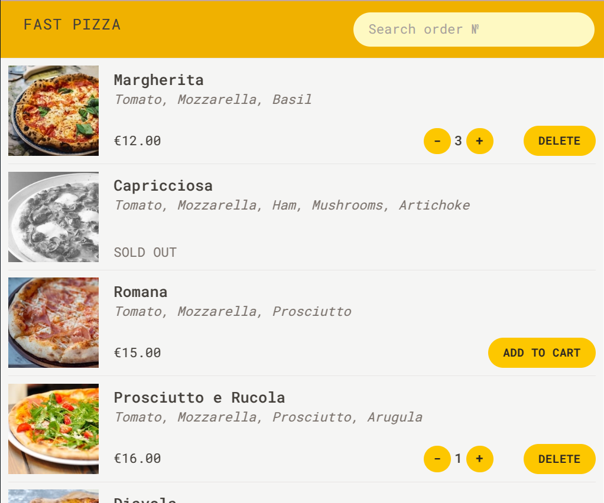

# 🍕 Fast Pizza — приложение заказа пиццы

## 📖 Описание

**Fast Pizza** — это интерактивное веб-приложение для оформления заказов пиццы с 
возможностью получения адреса пользователя.
Приложение построено на современном стеке React + Redux Toolkit и  TypeScript,
---

## ✨ Ключевые функции

- 🔍 🛒 Добавление и управление количеством товаров как в корзине, так и в меню
- 📦 Создание и отправка заказов через REST API
- 📍 Определение текущего местоположения пользователя и автозаполнение адреса
- 🧭 Навигация и формы с помощью React Router v7

---

## 🛠 Используемые технологии

- **React 18** + **TypeScript**
- **Redux Toolkit** (createAsyncThunk)
- **React Router** v7
- **TailwindCSS** + **Prettier Plugin**
- **ESLint** + **Prettier Config**
- **REST API** (BigDataCloud, Restaurant API)
- **Vite** для сборки